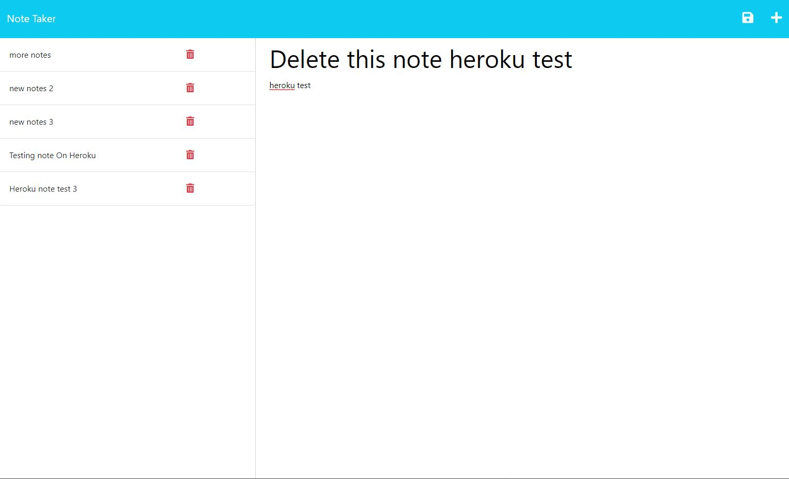

# 11--Express.js-Note-Taker

## Description

    It is a simple note taker application deployed on heroku. 
    Enter your Notes and able to delete or read to your previous notes. 
    It is being deployed on Heroku.   

  [Deployed HERE](https://mysterious-badlands-64903.herokuapp.com/)

## Table of Contents (Optional)

- [Installation](#installation)
- [Usage](#usage)
- [License](#license)
- [Contributing](#contributing)
- [Tests](#tests)
- [Questions](#questions)

## Installation

To install necessary dependencies, run the following command: 

    npm i  

## Usage

Step1: Visit [Here](https://mysterious-badlands-64903.herokuapp.com/) to access the app

step 2: type in your notes in the right side, and manage previous notes on the left column.
    example:

## License

N/A

## How to Contribute

N/A

## Tests

N/A